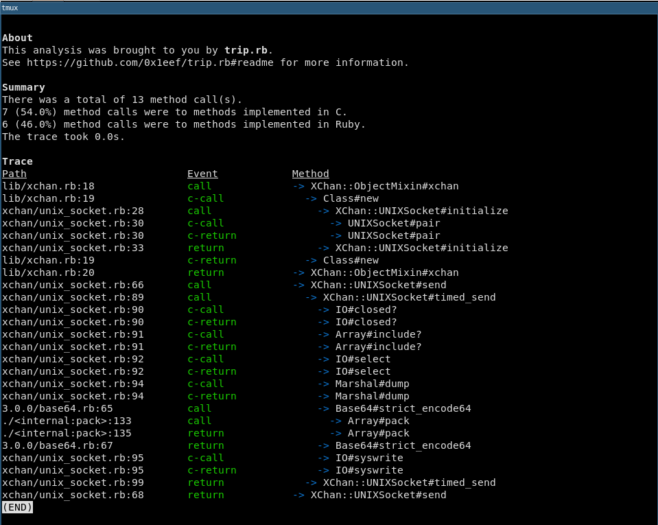
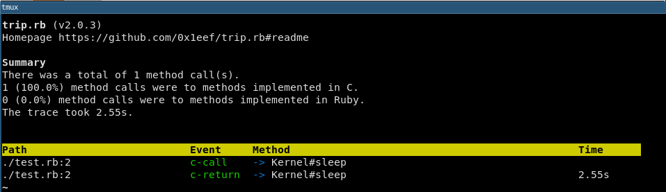

# trip.rb

**Table of contents**

* [Introduction](#introduction)
* [Getting started](#examples) 
  * [Using trip.rb as a concurrent tracer](#as-a-concurrent-tracer)
    * [Usage](#concurrent-tracer-usage)
  * [Using trip.rb as a stacktrace analyzer](#as-a-stacktrace-analyzer)
    * [Usage](#stacktrace-analyzer-usage)
    * [Precision](#stacktrace-analyzer-precision)
    * [Best guessing for methods implemented in C](#c-note)
* [Install](#install)
* [License](#license)

## <a id='introduction'>Introduction</a>

Trip.rb is a concurrent tracer that can pause, resume and alter the code 
it is tracing. The tracer yields control between two threads, typically 
the main thread and a thread that Trip.rb creates. Bundled with Trip.rb 
is a [stacktrace analyzer](#as-a-stacktrace-analyzer) that serves as an example 
and as a useful debugging tool. 

Under the hood, Trip uses `Thread#set_trace_func` and spawns a new thread
dedicated to running a block of Ruby code. Control is then yielded between 
the calling thread and Trip's thread until the trace completes.

## <a id='examples'>Getting started</a>

### <a id='as-a-concurrent-tracer'>Using trip.rb a concurrent tracer</a>

#### <a id='concurrent-tracer-usage'>Usage</a>

**1.**

By default the tracer pauses on method call and method return events from 
methods implemented in Ruby:

```ruby
def add(x,y)
  # C method calls ignored by the tracer:
  Kernel.puts x + y
end

trip = Trip.new { add(20,50) }
event1 = trip.start  # returns a Trip::Event (for the method call of "#add")
event2 = trip.resume # returns a Trip::Event (for the method return of "#add")
event3 = trip.resume # returns nil (thread exits)
```

**2.**

The logic for deciding when to pause the tracer can be customized using the 
`#pause_when` method. It accepts a block that receives an event (`Trip::Event`)
to help support making a decision on whether to pause the tracer or not:

```ruby
trip = Trip.new { Kernel.puts 1+6 }
trip.pause_when { |event| event.c_call? || event.c_return? }
event1 = trip.start # returns a Trip::Event (for a method call to a method implemented in C)
trip.stop           # returns nil, thread exits
```

**3.**

`Trip::Event#binding` returns a `Binding` object that provides access to the context
of where an event occurred. It can be used to run code in that same context through 
`Binding#eval`. This allows the surrounding environment to be changed while the tracer 
is paused:

```ruby
def add(x,y)
  to_s = "#{x} + #{y}"
end

trip = Trip.new { add(2,3) }
event1 = trip.start           # returns a Trip::Event (for the method call of add)
event1.binding.eval('x = 4')  # returns 4 (also changes the value of 'x')
event2 = trip.resume          # returns a Trip::Event (for the method return of add)
event2.binding.eval('to_s')   # returns '4 + 3'
trip.stop                     # returns nil, thread exits
```

### <a id='as-a-stacktrace-analyzer'>Using trip.rb as a stacktrace analyzer</a>

#### <a id='stacktrace-analyzer-usage'>Usage</a>

Trip.rb implements a stacktrace analyzer that can be useful for debugging and 
gaining insight into the code being traced. One day I might extract it into 
its own gem - for now it is shipped with the Trip.rb gem.

It has to be required it separately:

```ruby
require "trip/analyzer"
```

It requires the "paint" gem to be installed: 

```ruby
gem install paint
```

It can be invoked by calling `Trip.analyze` with a block:

```ruby
require "erb"
require "trip/analyzer"
Trip.analyze { ERB.new("foo").result }
```

Running 
    
    ruby -rxchan -rtrip/analyzer -e 'Trip.analyze { xchan.send 123 }' | less -c

shows a stacktrace similar to this:



#### <a id='stacktrace-analyzer-precision'>Precision</a>

The default precision used when printing the execution time of a method is 4. 
It can be changed with the `precision` keyword argument. For example:

```ruby
Trip.analyze(precision: 2) { sleep 2 }
```

shows a stacktrace similar to this:



#### <a id='c-note'>Best guessing for methods implemented in C</a> 

Trip.rb uses `#` to denote an instance method and it uses `.` to denote a 
singleton method (also known as a class method) in the traces it generates.

This proved diffilcult to determine for methods implemented in C because 
their binding's self is the self of the nearest Ruby method rather than the 
self of the method being traced - as is the case with methods implemented 
in Ruby.

The best solution I found to date was to take a best guess on which notation 
should be used for methods implemented in C. The best guess is sometimes
incorrect. It's worth keeping that in mind for `c-call` and `c-return` events.

Thankfully, methods implemented in Ruby don't have this problem.

## <a id='install'>Install</a>

    gem install trip.rb

## <a id='license'>License</a>

This project uses the MIT license - see [LICENSE.txt](./LICENSE.txt) for details.
