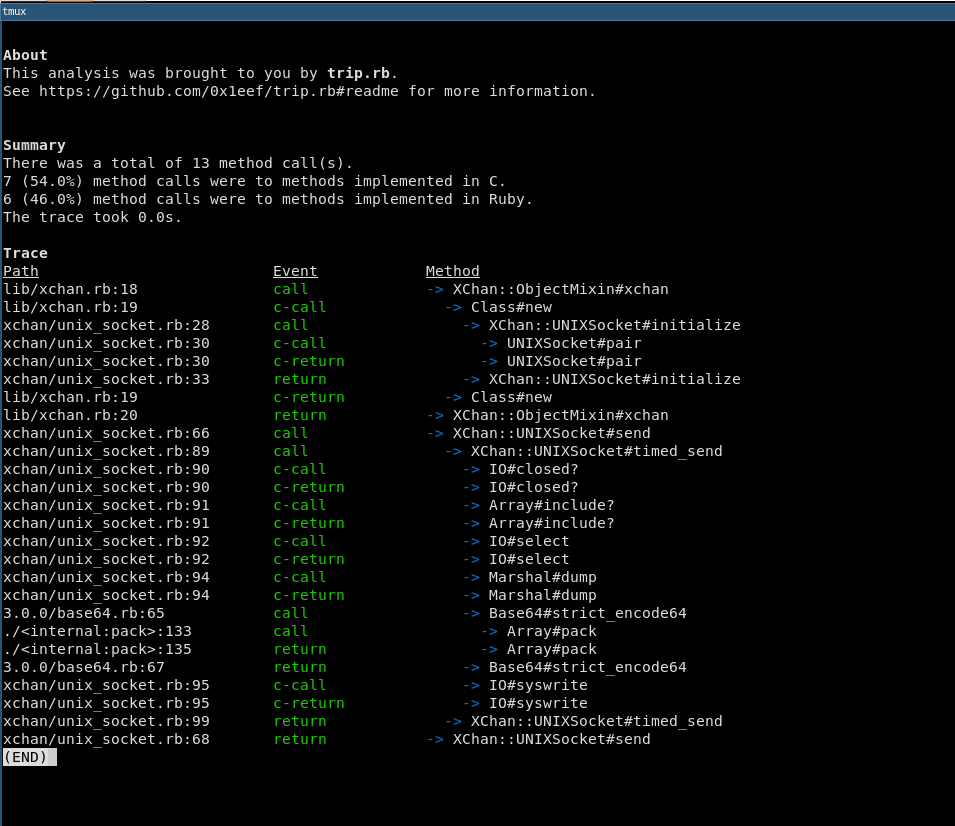

# trip.rb

**Table of contents**

* [Introduction](#introduction)
* [Examples](#examples) 
  * [As a concurrent tracer](#as-a-concurrent-tracer)
  * [As a stacktrace analyzer](#as-a-stacktrace-analyzer)
* [Install](#install)
* [License](#license)

## <a id='introduction'>Introduction</a>

Trip.rb is a concurrent tracer that can pause, resume and alter the code 
it is tracing. The tracer yields control between two threads, typically 
the main thread and a thread that Trip.rb creates. Bundled with Trip.rb 
is a [stacktrace analyzer](#as-a-stacktrace-analyzer) that serves as an example 
and as a useful debugging tool. 

Under the hood, Trip uses `Thread#set_trace_func` and spawns a new thread
dedicated to running a block of Ruby code. Control is then yielded between 
the calling thread and Trip's thread until the trace completes.

## <a id='examples'>Examples</a>

### <a id='as-a-concurrent-tracer'>As a concurrent tracer</a>

**1.**

By default the tracer pauses on method call and method return events from 
methods implemented in Ruby:

```ruby
def add(x,y)
  # C method calls ignored by the tracer:
  Kernel.puts x + y
end

trip = Trip.new { add(20,50) }
event1 = trip.start  # returns a Trip::Event (for the method call of "#add")
event2 = trip.resume # returns a Trip::Event (for the method return of "#add")
event3 = trip.resume # returns nil (thread exits)
```

**2.**

The logic for deciding when to pause the tracer can be customized using the 
`#pause_when` method. It accepts a block that receives an event (`Trip::Event`)
to help support making a decision on whether to pause the tracer or not:

```ruby
trip = Trip.new { Kernel.puts 1+6 }
trip.pause_when { |event| event.c_call? || event.c_return? }
event1 = trip.start # returns a Trip::Event (for a method call to a method implemented in C)
trip.stop           # returns nil, thread exits
```

**3.**

`Trip::Event#binding` returns a `Binding` object that provides access to the context
of where an event occurred. It can be used to run code in that same context through 
`Binding#eval`. This allows the surrounding environment to be changed while the tracer 
is paused:

```ruby
def add(x,y)
  to_s = "#{x} + #{y}"
end

trip = Trip.new { add(2,3) }
event1 = trip.start           # returns a Trip::Event (for the method call of add)
event1.binding.eval('x = 4')  # returns 4 (also changes the value of 'x')
event2 = trip.resume          # returns a Trip::Event (for the method return of add)
event2.binding.eval('to_s')   # returns '4 + 3'
trip.stop                     # returns nil, thread exits
```

### <a id='as-a-stacktrace-analyzer'>As a stacktrace analyzer</a>

Trip.rb implements a stacktrace analyzer that can be useful for debugging and 
gaining insight into the code being traced.

It has to be required separately:

```ruby
require "trip/analyzer"
```

it requires the "paint" gem to be installed: 

```ruby
gem install paint
```

It can be invoked by calling `Trip.analyze` with a block:

```ruby
require "erb"
require "trip/analyzer"
Trip.analyze { ERB.new("foo").result }
```

It displays a stacktrace similar to this:




## <a id='install'>Install</a>

    gem install trip.rb

## <a id='license'>License</a>

This project uses the MIT license - see [LICENSE.txt](./LICENSE.txt) for details.
